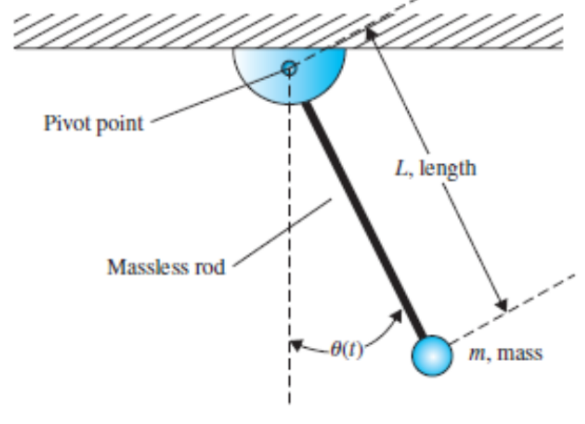
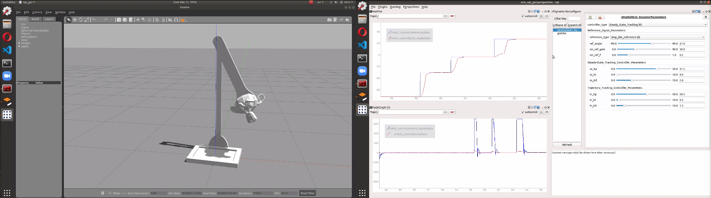

[![Contributors][contributors-shield]][contributors-url]
[![Forks][forks-shield]][forks-url]
[![Stargazers][stars-shield]][stars-url]
[![Issues][issues-shield]][issues-url]
[![MIT License][license-shield]][license-url]

[![LinkedIn][linkedin-shield]][linkedin-url]
[![YouTube][youtube-shield]][youtube-url]


<!-- PROJECT LOGO -->
<br />
<p align="center">
  

  <h1 align="center">Control of One-Dof Arm with Gazebo and ROS</h1>

  <p align="center">    
    <a href="https://youtu.be/Y_FozRTcjSg">View Demo</a>
    ·
    <a href="https://github.com/oguzhankose/one_dof_arm/issues">Report Bug</a>
    ·
    <a href="https://github.com/oguzhankose/one_dof_arm/issues">Request Feature</a>
  </p>
</p>


<!-- TABLE OF CONTENTS -->
<details open="open">
  <summary><h2 style="display: inline-block">Table of Contents</h2></summary>
  <ol>
    <li>
      <a href="#about-the-project">About The Project</a>
      <ul>
        <li><a href="#built-with">Built With</a></li>
      </ul>
    </li>
    <li>
      <a href="#getting-started">Getting Started</a>
      <ul>
        <li><a href="#prerequisites">Prerequisites</a></li>
        <li><a href="#installation">Installation</a></li>
      </ul>
    </li>
    <li><a href="#usage">Usage</a></li>
    <li><a href="#roadmap">Roadmap</a></li>
    <li><a href="#contributing">Contributing</a></li>
    <li><a href="#license">License</a></li>
    <li><a href="#contact">Contact</a></li>
    <li><a href="#acknowledgements">Acknowledgements</a></li>
  </ol>
</details>


<!-- ABOUT THE PROJECT -->
## About The Project


In this project, we are expected to create a single-link arm simulation in ROS/Gazebo environment and control the system. Example system model can be seen figure below.
<br />
<br />
<p align="center">
    <a>
        
    </a>
</p>

<br />

<!-- GETTING STARTED -->
## Getting Started

To get a local copy up and running follow these simple steps.

### Prerequisites

List of the packages that is required for this package is

* Robot Operating System(ROS)
* Dynamic Reconfigure Package
* Gazebo
* Rqt
  

### Installation

1. Clone the repo
   ```sh
   git clone https://github.com/oguzhankose/one_dof_arm.git
   ```
2. Build package with Catkin
   ```sh
   cd ~/one_dof_arm
   catkin_make
   ```

<br />

<!-- USAGE EXAMPLES -->
## Usage
<br />

<p align="center">
    <a>
        
    </a>
</p>
<br />

1. First, make sure that you sourced the package.
    ```sh
    source devel/setup.bash
2. Spawn the model of the robot in Gazebo
    ```sh
    sh spawn_model.sh
3. Start controllers and the GUI [From another terminal]
    ```sh
    sh control.sh
<br />

<!-- ROADMAP -->
## Roadmap

See the [open issues](https://github.com/oguzhankose/one_dof_arm/issues) for a list of proposed features (and known issues).


<br />

<!-- CONTRIBUTING -->
## Contributing

Contributions are what make the open source community such an amazing place to learn, inspire, and create. Any contributions you make are **greatly appreciated**.

1. Fork the Project
2. Create your Feature Branch (`git checkout -b feature/AmazingFeature`)
3. Commit your Changes (`git commit -m 'Add some AmazingFeature'`)
4. Push to the Branch (`git push origin feature/AmazingFeature`)
5. Open a Pull Request


<br />

<!-- LICENSE -->
## License

Distributed under the MIT License. See `LICENSE` for more information.


<br />

<!-- CONTACT -->
## Contact

Oguzhan Kose - [@twitter](https://https://twitter.com/koseoguzhan1) - koseo16@itu.edu.tr

Project Link: [https://github.com/oguzhankose/one_dof_arm](https://github.com/oguzhankose/one_dof_arm)


<!-- MARKDOWN LINKS & IMAGES -->
<!-- https://www.markdownguide.org/basic-syntax/#reference-style-links -->
[contributors-shield]: https://img.shields.io/github/contributors/oguzhankose/one_dof_arm
[contributors-url]: https://github.com/oguzhankose/one_dof_arm/graphs/contributors
[forks-shield]: https://img.shields.io/github/forks/oguzhankose/one_dof_arm
[forks-url]: https://github.com/oguzhankose/one_dof_arm/network/members
[stars-shield]: https://img.shields.io/github/stars/oguzhankose/one_dof_arm
[stars-url]: https://github.com/oguzhankose/one_dof_arm/stargazers
[issues-shield]: https://img.shields.io/github/issues/oguzhankose/one_dof_arm
[issues-url]: https://github.com/oguzhankose/one_dof_arm/issues
[license-shield]: https://img.shields.io/github/license/oguzhankose/one_dof_arm
[license-url]: https://github.com/oguzhankose/one_dof_arm/blob/master/LICENSE.txt
[linkedin-shield]: https://img.shields.io/badge/-LinkedIn-black.svg?style=for-the-badge&logo=linkedin&colorB=555
[linkedin-url]: https://linkedin.com/in/oguzhankose
[youtube-shield]: https://img.shields.io/youtube/views/Y_FozRTcjSg?label=YouTube&style=for-the-badge
[youtube-url]: https://www.youtube.com/watch?v=Y_FozRTcjSg


